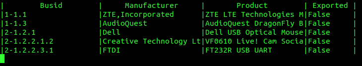
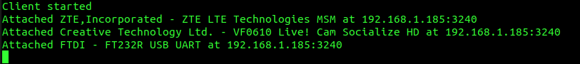

# RemoteHub

Tools for using USB devices over network on Linux. Includes client and server applications that
automatically connect server USB devices to client. The server and client communicate with [USBIP
protocol](https://www.kernel.org/doc/html/latest/usb/usbip_protocol.html).

## Features

* Data encryption using TLS
* Client can verify server with CA-certificate
* Server and client can find each other automatically on local network
* Both server and client are configured with JSON configuration file

## Building

Install: cmake, git and libusb headers.
For example in ubuntu:
```console
foo@foo:~/remotehub$ sudo apt install cmake git libusb-1.0-0-dev
```

Then create a build directory:

```console
foo@foo:~/remotehub$ mkdir build && cd build
```

Initialize cmake:
```console
foo@foo:~/remotehub/build$ cmake ..
```

Build the project.
```console
foo@foo:~/remotehub/build$ make install
```

If all goes well this will install the libraries and headers to lib/ folder and executables to bin/
folder.

## Usage

Run the server program and make sure rh_srv_conf.json contains valid data. Write the full path from
root directory to all path variables.

```console
foo@foo:~/remotehub/build$ sudo ../bin/rh_server -c ../example/rh_srv_conf.json
```

The server application will start and show currently connected USB devices. When client starts to
use a device 'Exported' column will indicate when it is in use.



On another computer in the same network run:
```console
bar@bar:~$ sudo modprobe vhci-hcd
bar@bar:~$ sudo ./rh_client -c ./rh_cli_conf.json
```

The provided client application attaches all of the devices that are set as usable.
They are at server/executable and client/executable. You can also modify them to suit your needs.



All available USB devices at server as configured with rh_srv_conf.json will now be attached to the
client. If both client and server are run locally on the same computer disable the VHCI USB buses by
using configuration file.

Both server and client can be terminated with CTRL+C or send the SIGINT signal if running in
background.

You can for example start the server in the background from the terminal by issuing:
```console
sudo -b ./bin/rh_server -c ./example/rh_srv_conf.json > /dev/null 2>&1
```
And kill the process with:
```console
sudo killall -2 rh_server
```

## Notes

Project depends on libusb which is not provided in the binaries. Minimum libusb version 1.0.21 is
required.

The USBIP protocol has
originally been introduced by Takahiro Hirofuchi et al. The RemoteHub client application uses the
existing USBIP VHCI kernel module. Client needs to load this with 'modprobe vhci-hcd'.
USBIP is explained in detail in the original [design overview paper](
https://www.usenix.org/legacy/events/usenix05/tech/freenix/hirofuchi/hirofuchi.pdf).

## License

```
RemoteHub - Tools for using USB devices over network

Copyright (C) 2021 Jani Laitinen

This program is free software: you can redistribute it and/or modify
it under the terms of the GNU General Public License as published by
the Free Software Foundation, either version 3 of the License, or
(at your option) any later version.

This program is distributed in the hope that it will be useful,
but WITHOUT ANY WARRANTY; without even the implied warranty of
MERCHANTABILITY or FITNESS FOR A PARTICULAR PURPOSE.  See the
GNU General Public License for more details.

You should have received a copy of the GNU General Public License
along with this program.  If not, see <https://www.gnu.org/licenses/>.
```
---
```
The project dependencies:

MbedTLS - Licensed under Apache License Version 2.0
cJSON   - Licensed under the MIT License
libusb  - Licensed under GNU LGPL Version 2.1

See COPYING and NOTICE files for full licenses.
```

## Related work

Original USBIP project is available in [usbip sourceforge](http://usbip.sourceforge.net/).
The developement of USBIP [drivers](https://github.com/torvalds/linux/tree/master/drivers/usb/usbip)
and [userspace tools](https://github.com/torvalds/linux/tree/master/tools/usb/usbip)
has been later merged with linux project starting from kernel version 3.17.

There are also numerous other USBIP projects such as:\
USBIP for Windows: https://github.com/cezanne/usbip-win\
USBIP with libusb server: https://github.com/novimusica/usbip-next\
USBIP in Rust language with example emulation devices: https://github.com/jiegec/usbip
